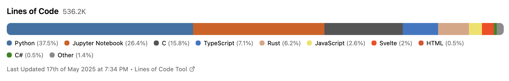

# Lines of Code

Show the number of lines of code you've written in each language with a beautiful, embeddable widget. Try it out here https://linesofcode.yehiaabdelm.com



For language colors I used linguist's languages.yml https://github.com/github-linguist/linguist/blob/main/lib/linguist/languages.yml.

You can run your own instance by cloning this repository and setting up your environment variables. The widget is customizable through query parameters:

- `exclude`: excludes languages with a percentage lower than the specified value (e.g., exclude=5 hides languages below 5%)
- `metric`: choose what to display 'bytes' for bytes of code or 'lines' for lines of code (default: lines)
- `theme`: visual theme for the embed: 'light' (default) or 'dark'
- `limit`: maximum number of languages to display (default: shows all)
- `other`: combine remaining languages into an "Other" category (default: false)

Data is automatically refreshed weekly. Feel free to open an issue if you find any bugs or have suggestions for improvements.

## Setup

1. Clone the repository
2. Install dependencies:

```bash
npm install
```

3. Create a `.env` file with the following variables:

```env
PUBLIC_BASE_URL=          
S3_ACCESS_KEY_ID=        
S3_SECRET_ACCESS_KEY=    
S3_ENDPOINT=            
S3_BUCKET=             
GITHUB_CLIENT_ID=    
GITHUB_CLIENT_SECRET=  
ENCRYPTION_SECRET=    
GITHUB_API_URL=https://api.github.com
```

4. Start the development server:

```bash
npm run dev
```

The app should run at `http://localhost:5173`
